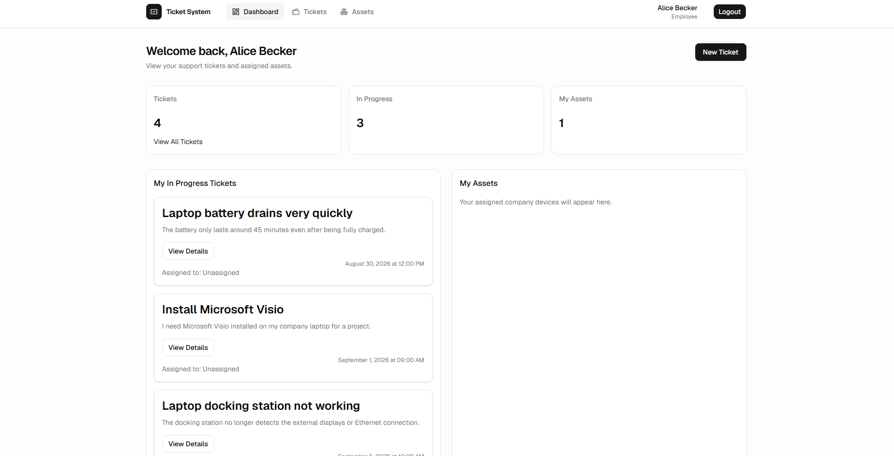
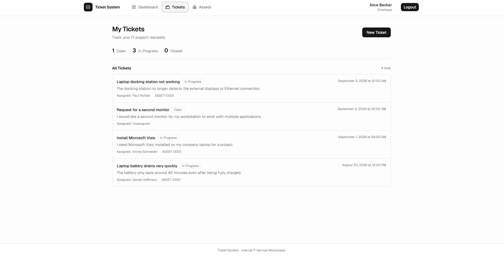
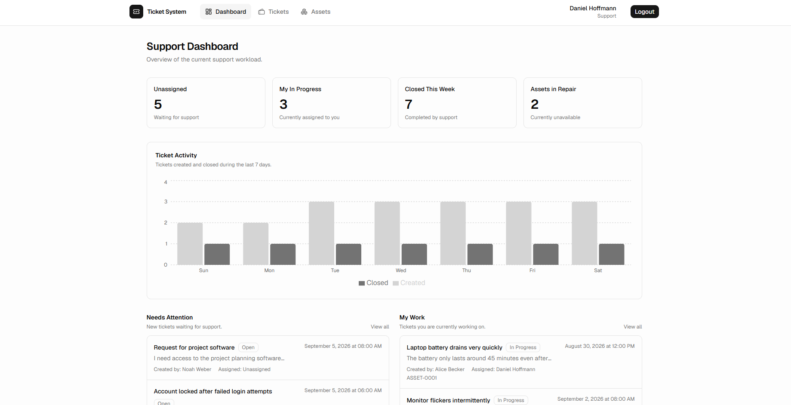
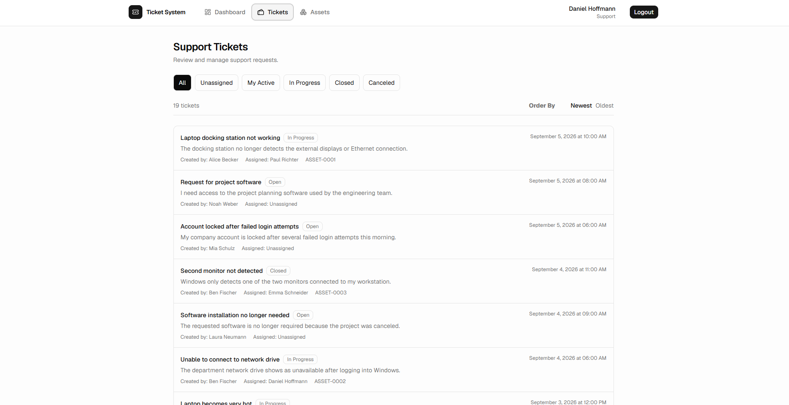
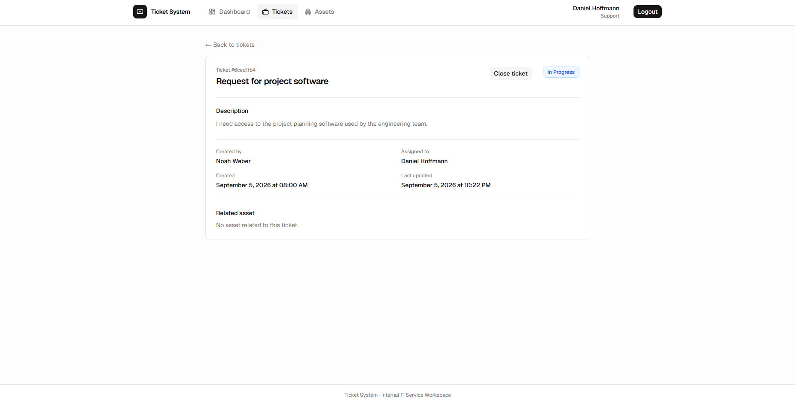
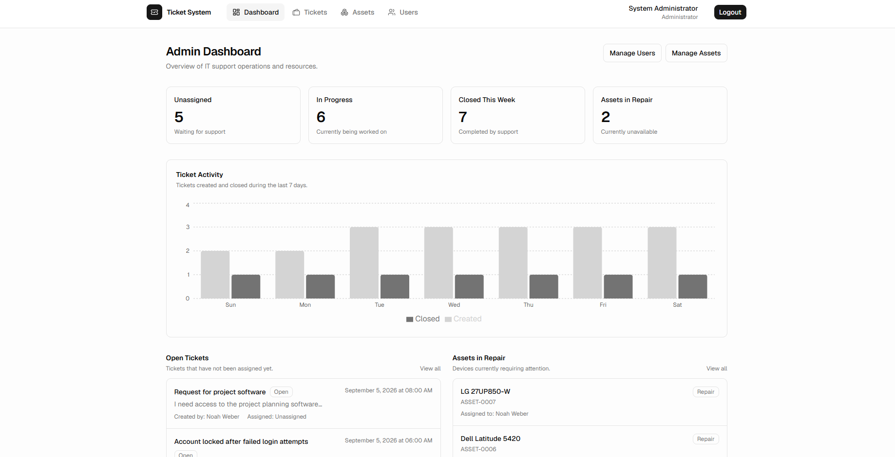
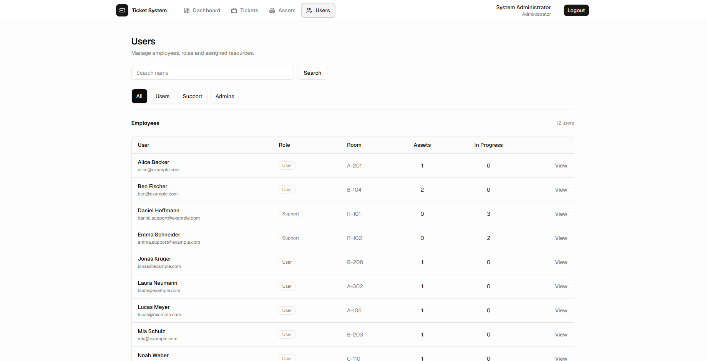

# Ticket System

## Description

A full-stack internal IT support application built with Next.js, TypeScript, Prisma and PostgreSQL.

Employees can create support tickets and view their assigned devices. Support staff can manage tickets, while administrators can manage users, assets and overall support operations.

## Why I Built This

During an internship at a local town hall, I saw how IT requests and company devices were managed through an internal system. This inspired me to build my own simplified helpdesk and asset management application.

## Live Demo

https://ticket-system-mu-tawny.vercel.app

## Demo Accounts

User:

`alice@example.com`

Support:

`daniel.support@example.com`

Admin:

`admin@example.com`

Password for all demo accounts:

`Password123!`

## Screenshots

### User Dashboard

### My Tickets

### Support Dashboard

### Support Ticket Management

### Ticket Details

### Admin Dashboard

### User Management

## Tech Stack

- Next.js
- TypeScript
- PostgreSQL
- Prisma
- Neon
- Auth.js / NextAuth
- Tailwind CSS
- shadcn/ui
- React Hook Form
- Zod
- Recharts
